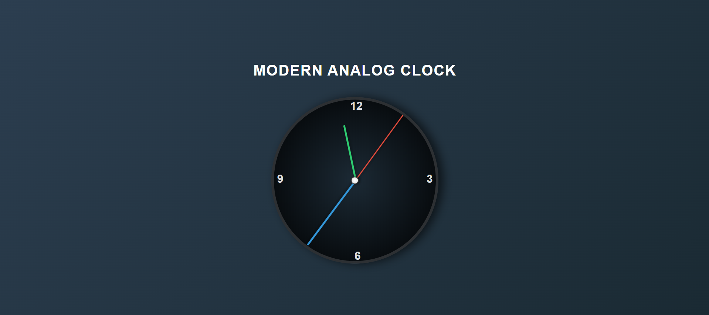

# Analog Watch

An interactive and visually enhanced analog watch built using HTML, CSS, and JavaScript. This project showcases a sleek, modern analog clock with dynamic hands for hours, minutes, and seconds. The clock's design is enhanced with glowing effects and smooth animations for a user-friendly and engaging experience.

## Features
- **Modern Design**: A stylish clock with glowing hands and numbers.
- **Responsive Layout**: The clock adapts to various screen sizes and remains centered.
- **Smooth Animations**: The clock hands rotate smoothly, with hover effects to add interactivity.
- **Real-time Updates**: The watch updates in real time, displaying the current time in an elegant way.

## See How It Looks
  
*This is how the Analog Watch looks when rendered in the browser.*

## Usage
- Clone or download the repository to view the analog clock in action.
- Open the `index.html` file in your browser to see the clock live.

## Customization
You can easily customize the clock's appearance and functionality:
- Modify the color scheme by changing the background gradients and hand colors in the CSS.
- Adjust the clock size by updating the dimensions in the `.container` class.
- Experiment with the animation speed by tweaking the CSS transition properties.

## Technologies Used
- **HTML**: Structure of the clock.
- **CSS**: Styling, animations, and layout.
- **JavaScript**: To ensure real-time updates for the time (if applicable).

## Contributing
Feel free to fork this repository, make improvements, or open issues for suggestions. Contributions are welcome!

---
Enjoy your Analog Watch!
